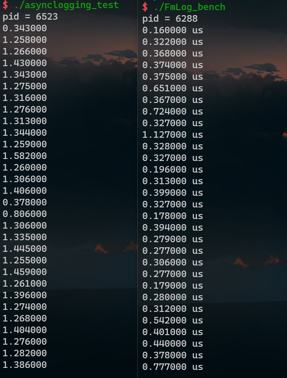
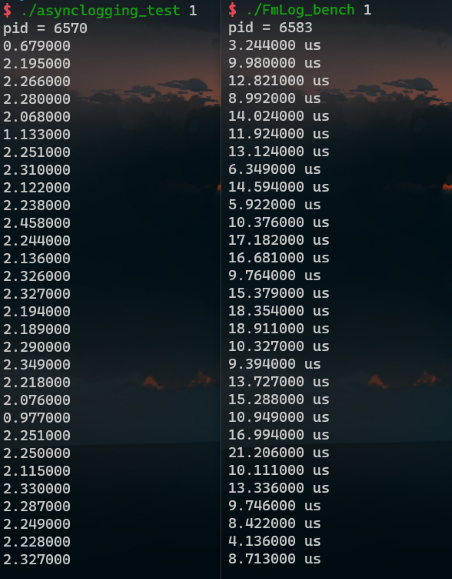

# FmLog：A Simple Asynchronous/Stdout Logger Library

## 1. 项目特点

1. 内存使用紧凑节省。对于日志行尽可能减少常量字符串的拷贝（使用`std::string_view`），并将日志行的元信息以编码的方式放入到日志行的缓冲区中而不是直接将日志消息`memcpy()`到其中，最后实时解析输出。
2. 而且日志缓冲队中的缓冲区内存会以池的形式得到重复利用，自己实测中基本重复利用两个日志缓冲块就可以满足日志的交换输入输出。
3. 可以使用异步日志工作方式，将真正的日志输出工作交给异步的背景线程去做。
4. 日志输出速度非常快。实测至少比muduo中实现的日志库更快，在`examples`目录中有类似于muduo的benchmark测试程序；
5. 日志文件支持每日滚动，并且默认每隔3秒自动刷新一下；
6. 使用现代C++。


## 2. 原理图


## 3. 使用说明

如下是一个简单的代码示例：

```cpp
#include "fmlog/Log.h"
#include <libgen.h>

int main(int argc, char *argv[]) {
  constexpr uint32_t mb = 1024 * 1024;
  fm::log::setLogLevel(fm::log::LogLevel::kINFO);
  // 初始化日志器是必须要做的
  fm::log::initialize(fm::log::AsyncLoggerTag{}, "./", 
                      ::basename(argv[0]), 100 * mb);

  // 连续输出10000行日志
  for(size_t i = 0; i < 10000; ++i)
      LOG_INFO << "talk is cheap, show me the code!";
    
  return 0;
}
```


## 4. 编译安装

```bash
$> ./build.sh
$> sudo make install
$> sudo echo "/usr/local/lib" > /etc/ld.so.conf
$> sudo ldconfig
```


## 5. 性能实测

测试平台：5.4.72-microsoft-standard-WSL2 CPU i7-4790 内存ddr3-1600Mhz 硬盘Toshiba-TR200 SSD

1、分别在muduo和FmLog上进行短字符串内容或者`std::string_view`内容的性能测试：



可以看到相同的输出内容下，对于短字符串或常量字符串内容，FmLog的性能在同一个平台上输出性能性能更好，另一方面的好处就是FmLog使用的内存更加节省（这点测试我比较直观，略）。正由于FmLog紧凑内存、实时解析的特点所以比muduo节省了将近一半的性能。

2、分别在muduo和FmLog上进行长字符串内容的性能测试：



可以看到相同的输出内容下，对于长字符串`std::string`内容，FmLog出现了严重性能下降，造成如此现象的主要原因就是FmLog的实时解析机制。由于长字符串`std::string`在存放到缓冲区时必须逐字符挨个放入其中并在输出时实时解析出来（这个时候又得挨个遍历，直到当前字符串的'\0'才停止），所以性能的下降就非常明显。一种替代的方式就是使用`std::string_view`来包装下`std::string`，但这需要`std::string`的生命周期得到一定的延长，而程序可能不愿意这样做。而且另一个缺点就是一旦使用长字符串`std::string`输入FmLog，这很有可能造成内存的重分配，使得LogLine放弃使用类对象中的栈内存stack buffer，而是使用`unique_ptr`去管理一块新的更大的堆内存，这个内存开销还是非常大的。

基于上面的实测和阐述，因此我们更倾向于将这个日志库使用在一些更倾向于使用常量字符串（多长都无所谓）但对动态长字符串`std::string`不感兴趣的场合。（实际上这个日志库就是用来玩的😂，哈哈）。

一种改进的方案就是使用放弃实时解析的方案，直接将后续用户给定的数据放入到缓冲区内（格式化字符串），然后直接在输出的时候指定起点和长度然后输出，这样的话对于长字符串输出的性能就可能提高很多，但内存节省的目的就可能有所影响。


## 6. 参考资料

1. [muduo网络库](https://github.com/chenshuo/muduo)

