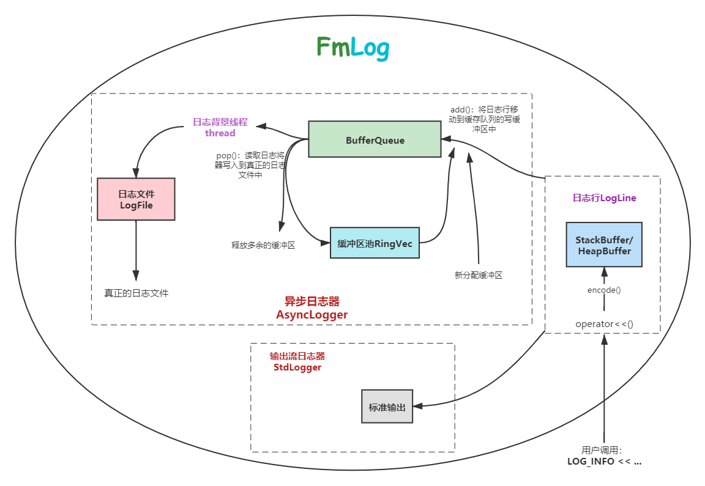

# FmLog：A Simple Asynchronous/Stdout Logger Library

## 1. 设置特点

1. 内存使用紧凑节省。对于日志行尽可能减少常量字符串的拷贝（使用`std::string_view`），并将相关的数据以编码的方式放入到日志行的缓冲区中而不是直接`memcpy()`到其中，最后输出时实时解析输出；
2. 可以使用异步日志工作方式，将真正的日志输出工作交给异步的背景线程去做，所以输出很快。至少比muduo中实现的日志库快，在`examples`目录中有类似于muduo的benchmark测试程序；
3. 日志文件支持每日滚动，并且默认每隔3秒自动刷新一下；
4. 使用了现代C++中很多新特性。


## 1. 原理图



## 2. 使用说明

如下是一个简单的代码示例：

```cpp
#include "fmlog/Log.h"

int main(int argc, char *argv[]) {
  constexpr uint32_t mb = 1024 * 1024;
  fm::log::setLogLevel(fm::log::LogLevel::kINFO);
  // 初始化日志器是必须要做的
  fm::log::initialize(fm::log::AsyncLoggerTag{}, "./", 
                      ::basename(argv[0]), 100 * mb);

  // 连续输出10000行日志
  for(size_t i = 0; i < 10000; ++i)
      LOG_INFO << "talk is cheap, show me the code!";
    
  return 0;
}
```


## 3. 编译安装

```bash
$> ./build.sh
```


## 4. 参考资料

1. [muduo网络库](https://github.com/chenshuo/muduo)

